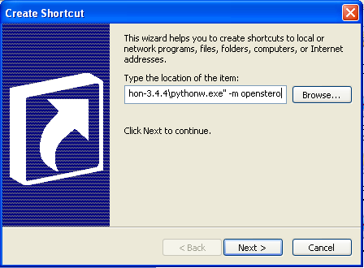

Installation
============

Windows
-------

Download the latest .exe installer from:

https://github.com/endarthur/os/releases/latest

When updating, please uninstall the previous version before installing the new.

The releases also contain an experimental portable executable for OpenStereo,
with a name starting with ``OpenStereo_Portable`` followed by the build date.
Please report any issues when using the portable version.

Windows XP
~~~~~~~~~~

Download and execute `WinPython-32bit-3.4.4.1Qt5.exe`_ from sourceforge. Python
3.4 is the last python available for Windows XP, and `winpython`_ is a portable
distribution pre-packaged with most of the prerequisites for OpenStereo. Inside
the folder you just extracted, execute the ``WinPython Command Prompt``, and
install OpenStereo using::

    pip install https://github.com/endarthur/os/tarball/master#egg=openstereo

.. _WinPython-32bit-3.4.4.1Qt5.exe: https://sourceforge.net/projects/winpython/files/WinPython_3.4/3.4.4.1/WinPython-32bit-3.4.4.1Qt5.exe/download
.. _winpython: http://winpython.github.io/

After that, you may either open the ``WinPython Command Prompt`` and run::

    python -m openstereo

Or create a shortcut, by right clicking on your desktop, selecting new,
shortcut, browsing to the file ``python-3.4.6\pythonw.exe`` inside the folder
and adding the parameter ``-m openstereo`` after the file, as such:

The icon for OpenStereo is located inside the ``ui_files/icons`` directory on
the github repository, or downloaded with
`this link`_.

.. _this link: https://github.com/endarthur/os/raw/master/ui_files/icons/openstereo.ico

macOS Installation
------------------

First install pyqt5 and python3 (python3 is automatically installed as a
dependency of pyqt5) using `homebrew`_::

    $ brew install pytqt

.. _homebrew: https://brew.sh/

Once that is done, install OpenStereo from `github`_ using pip3::

    $ pip3 install git+https://github.com/endarthur/os#egg=openstereo

.. _github: https://github.com/endarthur/os

Ubuntu
------

First install pyqt5 and pip::

    $ sudo apt install python3-pyqt5 python3-pip

Once that is done, install OpenStereo from `github`_ using pip3::

    $ pip3 install https://github.com/endarthur/os/tarball/master#egg=openstereo

Mint Cinnamon
-------------

First install pyqt5, pip and setuptools from the distribution repository::

    $ sudo apt install python3-pyqt5 python3-pip python3-setuptools

Then install wheel using pip::

    $ pip3 install wheel

Once that is done, install OpenStereo from `github`_ using pip3::

    $ pip3 install https://github.com/endarthur/os/tarball/master#egg=openstereo

Fedora
------

First install pyqt5::

    $ sudo yum install python3-qt5

Once that is done, install OpenStereo from `github`_ using pip3::

    $ sudo pip3 install https://github.com/endarthur/os/tarball/master#egg=openstereo

openSUSE
--------

First install pyqt5::

    $ sudo zypper install python3-qt5

Once that is done, install OpenStereo from `github`_ using pip3::

    $ sudo pip3 install https://github.com/endarthur/os/tarball/master#egg=openstereo

Arch Linux
----------

First install pyqt5 and pip::

    $ sudo pacman -S python-pyqt5 python-pip

After that, install openstereo from `github`_ using pip::

    $ sudo pip3 install https://github.com/endarthur/os/tarball/master#egg=openstereo

Installing pyqt5 from pip also works, in case there is any issue installing
with pacman.

Other Linux distros
-------------------

In general, install pyqt5 for python3, either from the distro repositories or
PyPI. PyQT5 is not listed as a requirement on OpenStereo's setup file, as its
installation may fail in some cases, though the other requirements can usually
be installed automatically without any issues.

After installing pyqt5, install openstereo using pip3 (to force it to use
python3)::

    $ pip3 install https://github.com/endarthur/os/tarball/master#egg=openstereo

You may either have to run this command with sudo or by adding the ``--user``
flag to pip3. In case you use the flag, you'll have to run OpenStereo using::

    $ python3 -m openstereo

Instead of just ``openstereo``, though you can add this as an alias to your
.bash_aliases file.

From PyPI
---------

At the command line::

    pip install https://github.com/endarthur/os/tarball/master#egg=openstereo

Additionally, install PyQt5 from PyPI if needed (for python 2.7, use package
python-qt5 instead).
