An OpenStereo Tutorial
======================

First, install OpenStereo by following the instructions on the
:doc:`installation page <install>` for your operating system. Make sure to
update whenever a new release is available.

After installing, open the program either from your start menu or from command
line as either::

    python -m openstereo

Or::

    openstereo

Optionally, an ``.openstereo`` :ref:`project file <project-files>` can be opened::

    openstereo example_project.openstereo

From that, you are brought to the main window:

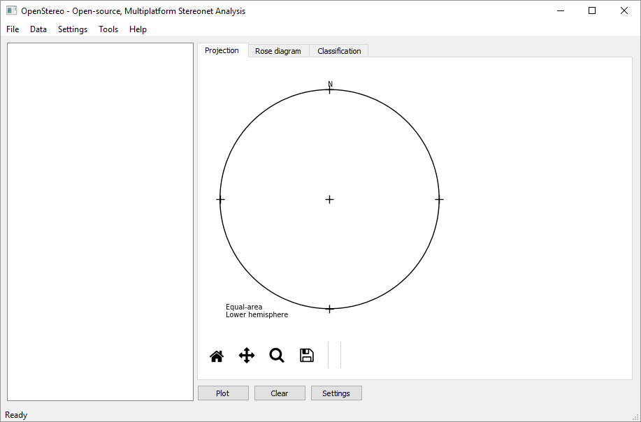

From the File menu you can open or save projects and import files. The quickest
way to open a simple data file is using the specific import actions. for
example, ``Import Plane Data (DD)``:

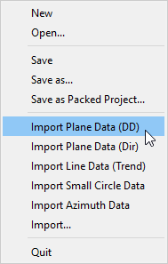

OpenStereo supports both CSV files and excel spreadsheets. Download
``tocher_header.txt`` from the `example data`_ directory inside the 
repository and select it after clicking this option. After loading, either
click ``Plot`` or press ``Ctrl+P`` on your keyboard to view the poles of this
example:

.. _example data: https://minhaskamal.github.io/DownGit/#/home?url=https://github.com/endarthur/os/tree/master/example_data

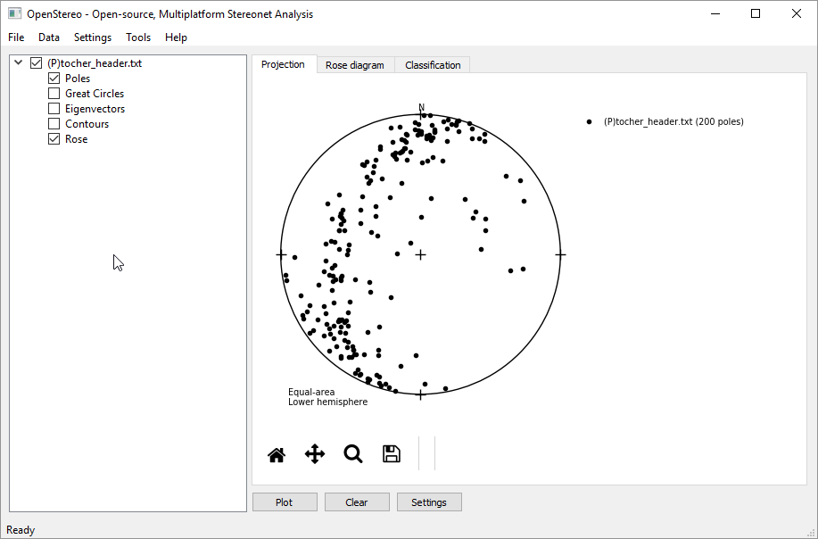

The Projection plot is interactive. The attitude of the point under the mouse
will appear on the lower right corner when you mouse over the plot. Also, if
you click and drag over the plot you'll be able to both measure angles
and see the attitude of the plane formed by the point you first clicked and the
current point:

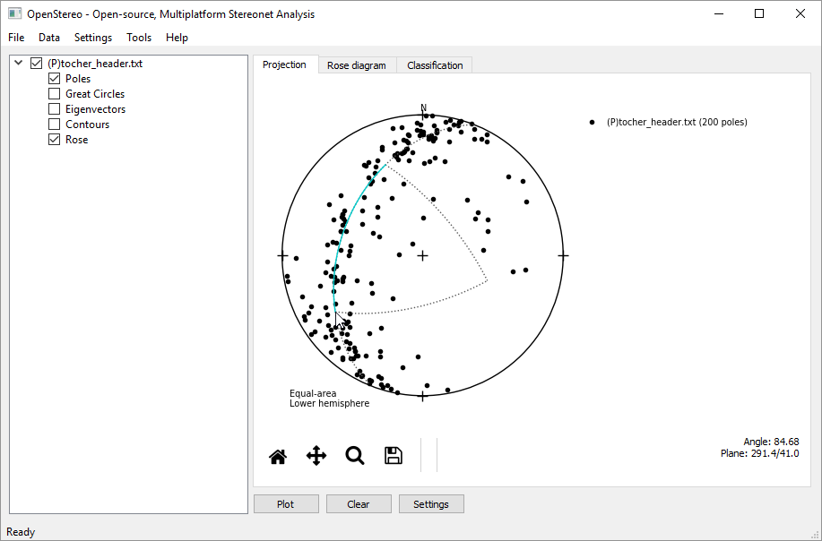

It is also possible to plot the great circles, eigenvectors and contours of
a planar dataset. Click on the check boxes of these options under the
``(P)tocher_header.txt`` item on the data tree and press plot to get a very
busy view of the data:

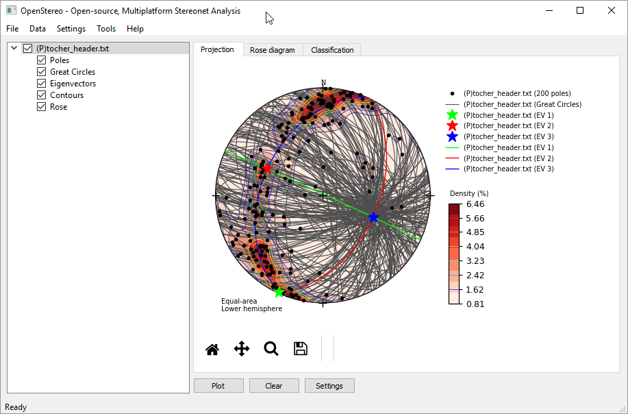

Disable the Great Circles option for now and right click on the Tocher item (or
over any of its options) to get its context menu:

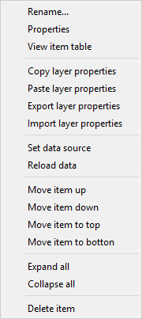

You can rename, delete, reorder, reload and change the display properties of
the item using this menu. Click on ``Properties`` to do so:

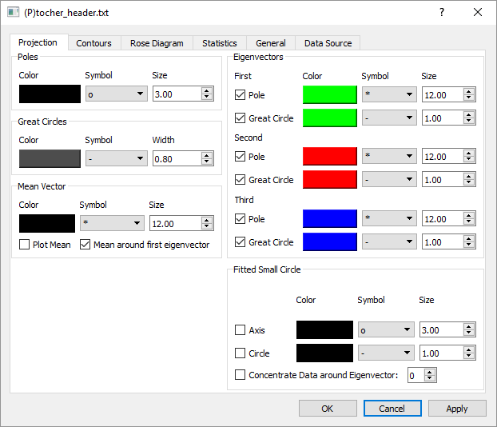

Most plot options for the Projection plot tab on the main window are located on
this first tab, with the exception of contour plots. Try changing some options,
such as color and size of poles (on the top left), while disabling poles and
great circles of the first and second eigenvectors, and change the color of the
pole and great circle of the third eigenvector. If you click ``OK`` the changes
will be accepted and the dialog will close, but if you click ``Apply`` instead,
the dialog will remain open.

You can keep the dialog open and still interact with OpenStereo,  even while
opening the properties dialog of multiple items. Press apply and see the
changes on the plot:

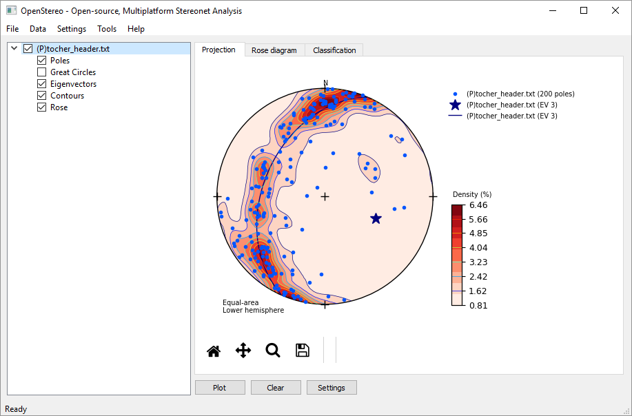

On the Contours tab of the properties dialog you may change the many different
related options:

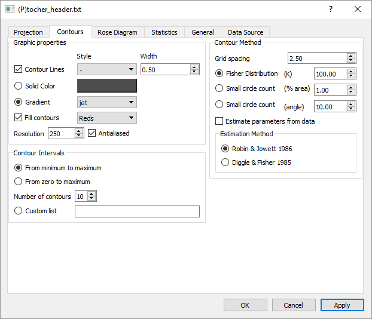

Try a few different graphic options for the contours, as changing the fill
contours gradient to something like ``Greens_r``. You may also change the
number of contours and the way they are built. In the right side, it is
possible to configure which method will be used for the contouring,
either as a count of the number of poles inside a small circle around each node
or by exponentially smoothing each point to every node using the Fisher 
distribution.

The parameter K controls how smooth the contribution of each point will be.
Smaller values of K will smooth more, while larger ones will make each point
contribute only to a small area around it.

In general you'll have to try a few different options for your dataset to find
the best smoothing coefficient. To help with that, OpenStereo includes two
published methods to estimate good parameters. Robin & Jowett (1986)
[RJ86]_ is very quick, as it calculates the recommended K based
only on the number of poles,
while Diggle & Fisher (1985) [DF85]_ performs an optimization using cross validation
to find which parameter best represents your data. Change the K parameter to
50 and plot the results:

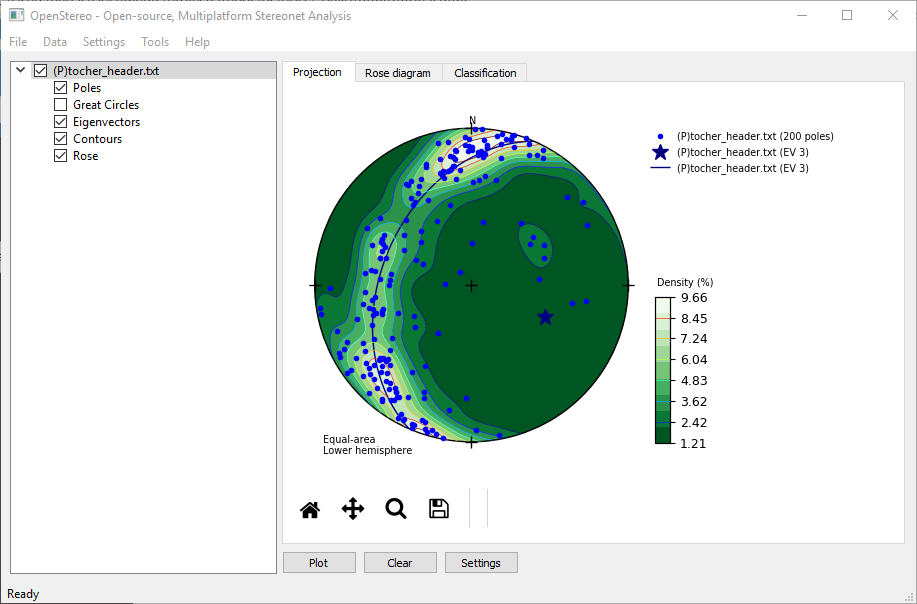

Skip to the ``General`` tab on the properties dialog. Here you may change which
of the plot items will be added to the projection legend, and if desired,
specify a legend text for each plot item instead of the default by writing
on the text box besides each option.

It is possible to use parameters from your dataset on the legend text. Check
the :ref:`legend reference <legend>` for how to use this feature. Specify the
Pole legend for the third eigenvector as ``pole to the fitted girdle``, and its
great circle legend as::

    fitted girdle ({data.eigenvectors_sphere[0]})

You can also open multiple data files of the same type. Download both
``normal_faults.xlsx`` and ``qplot.txt`` from the example data and open them
using the import plane data (DD) action. Disable the Tocher item and plot the new
data:

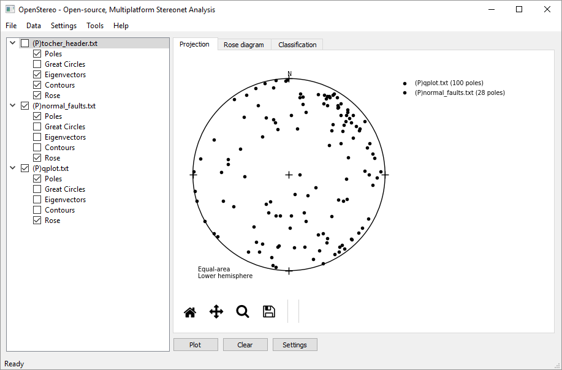

The normal_faults file contains both the orientation of a plane and a line on
each row. As the data set contains no headers, it has no way of detecting which
columns contain the attitude for the lines and the planes, so you must provide
this information.

The most generic way of opening a data set in OpenStereo is using the
``Import...`` action on the file menu. After clicking this and selecting the
normal_faults file the following dialog will appear:

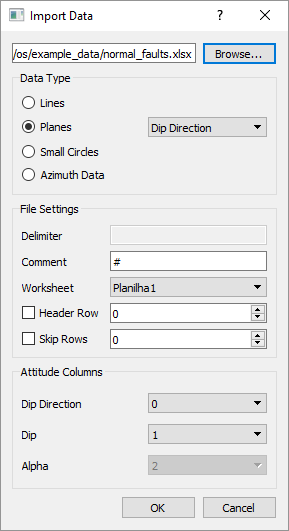

Change the data type to Lines, and the trend and plunge to columns 2 and 3,
respectively. Click ``OK`` to load the lines, disable the other items and press
plot to view the results:

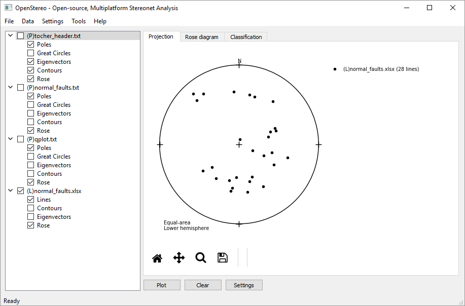

Our project now contains four items, and it's probably time for some better
organization. Right click on any item and select ``Colapse All`` to hide the
plot options. Rename the items by either using ``Rename...`` on the context
menu or pressing F2 on your keyboard after selecting an item. After that, you
may reorder the items by either clicking and dragging or using the move item
actions on the menu. As an example of the results:

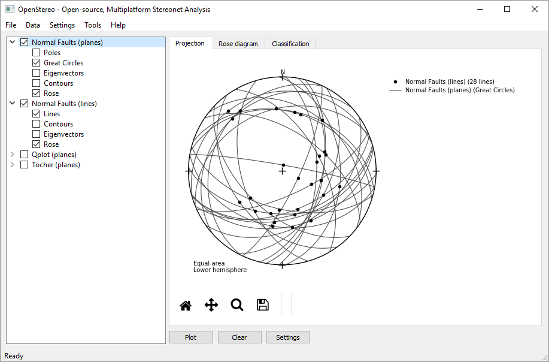

There are also some general configurations for the whole project, which can be
found by either clicking on the ``Settings`` button under the plot or the 
``Project Settings`` action on the settings menu. This dialog will appear:

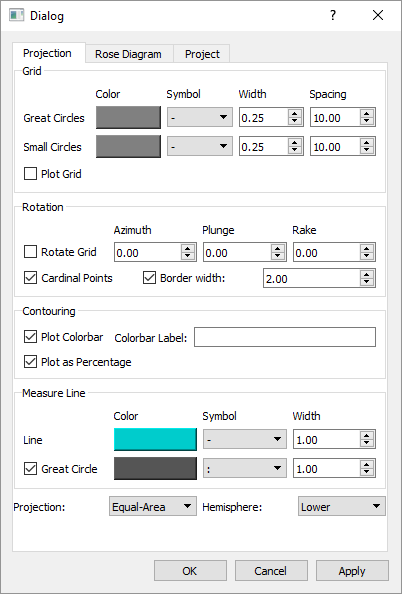

Click on the ``Plot Grid`` checkbox to add an equal-area net on your plot. You
may also rotate the whole projection by using the rotate grid option. For
example, -30.0, 50.0 and 45.0 as azimuth, plunge and rake, respectively. Click
``Apply`` to see the results:

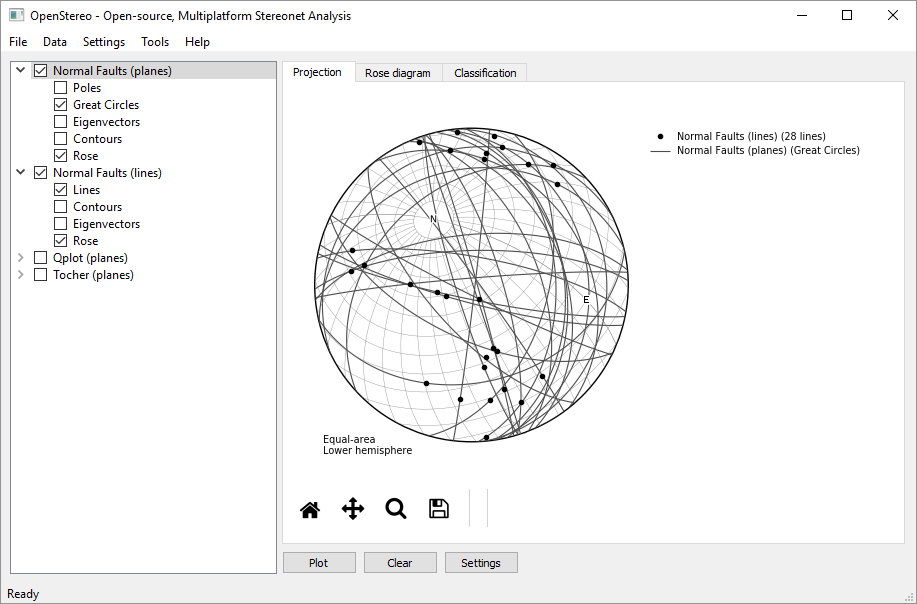

You can also see and add some metadata to your project on ``Project`` tab on
the settings dialog:

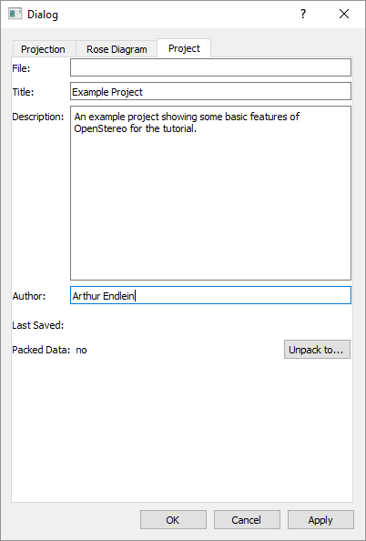

There are two types of OpenStereo :ref:`project files <project-files>`: regular
and packed. They both use the .openstereo extension, and the main difference is
that packed projects include the data files inside them, to facilitate sharing
projects. Packed projects may be unpacked to a directory using the
``Unpack to...`` button on the project tab of the settings dialog.

To finish this tutorial, save the resulting project as a regular one (using
either ``Save``  or ``Save as...`` on the file menu). Regular projects store
the relative paths between the .openstereo file and the data files, so you
can transport the whole project to different computers by just keeping the
same directory structure, as when sharing a folder through Dropbox or a similar
service.

If OpenStereo can't find the data when opening the project, it will ask you for
its location. To make this process easier, for each location of these you
provide the software will try to find the remaining files relative to both the
project file and these given locations.

..
    In most cases you don't need to use the import dialog directly. Download and
    open the ``qplot.txt`` dataset using the ``Import Line Data (Trend)``.

..
    .. image:: images/os_import.png
        :align:   center

    If you try to open a CSV file, as is the case, OpenStereo will automatically
    try to detect the dialect used, mainly the delimiter. Following that it will
    check if your dataset contains a header. In this example, the separator is
    comma and it contains a header, as detected. You may change any of these
    options if you think they are wrong.

    By default, it will interpret your file as planes, and try to guess from the
    header which columns represent dip direction and dip, or take the first and
    second columns, respectively. Press ``OK`` to load the data and either click
    ``Plot`` or press ``Ctrl+P`` on your keyboard to view the poles of this
    example: